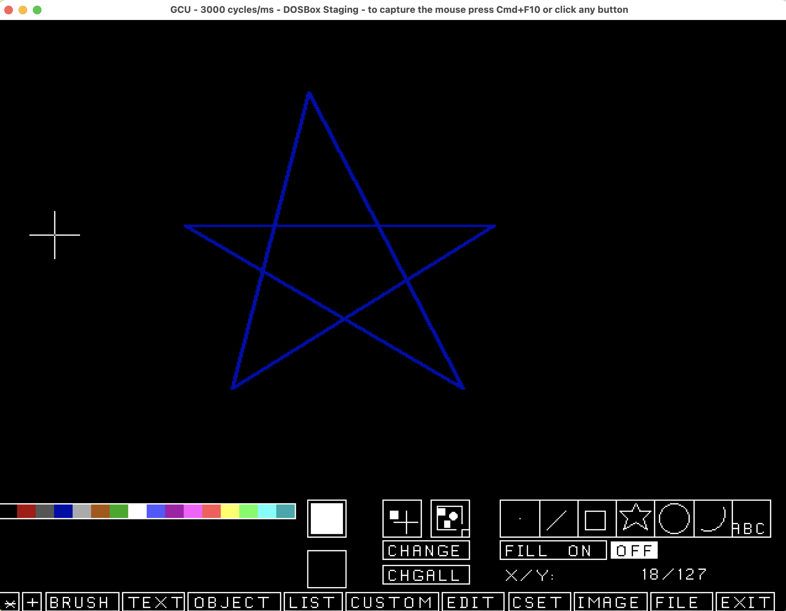

# NaplpsWriter

This project is an Elixir implementation of a library to create [NAPLPS graphics files](https://en.wikipedia.org/wiki/NAPLPS).
NAPLPS is the graphics format used in the Prodigy Online system, revived at [The Prodigy Reloaded project](https://github.com/ProdigyReloaded).


This code
```
  import NaplpsWriter
  use NaplpsConstants
  ...
      gcu_init()
      |> append_byte(@cmd_shift_in)
      |> select_color(@color_blue)
      |> draw(@cmd_set_point_abs, {75 / 256, 75 / 256})
      |> draw(@cmd_line_rel, [
        {25 / 256, 100 / 256},
        {50 / 256, -100 / 256},
        {-90 / 256, 55 / 256},
        {100 / 256, 0 / 256},
        {-85 / 256, -55 / 256}
      ])
      |> draw(@cmd_set_point_rel, [])
```
will produce a drawing



## Installation

If [available in Hex](https://hex.pm/docs/publish), the package can be installed
by adding `naplps_writer` to your list of dependencies in `mix.exs`:

```elixir
def deps do
  [
    {:naplps_writer, "~> 0.1.0"}
  ]
end
```

Documentation can be generated with [ExDoc](https://github.com/elixir-lang/ex_doc)
and published on [HexDocs](https://hexdocs.pm). Once published, the docs can
be found at <https://hexdocs.pm/naplps_writer>.

