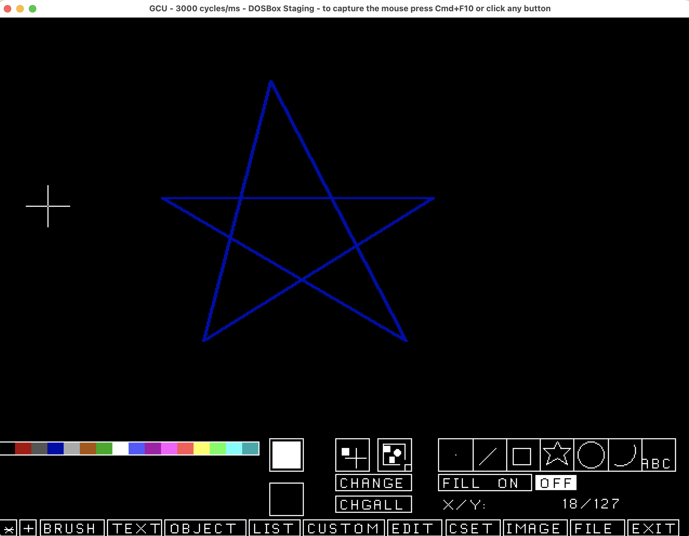

# NaplpsWriter

This project is an Elixir implementation of a library to create [NAPLPS graphics files](https://en.wikipedia.org/wiki/NAPLPS).
NAPLPS is the graphics format used in the Prodigy Online system, revived at [The Prodigy Reloaded project](https://github.com/ProdigyReloaded).


This code
```
  import NaplpsWriter
  use NaplpsConstants
  ...
      gcu_init()
      |> append_byte(@cmd_shift_in)
      |> select_color(@color_blue)
      |> draw(@cmd_set_point_abs, {75 / 256, 75 / 256})
      |> draw(@cmd_line_rel, [
        {25 / 256, 100 / 256},
        {50 / 256, -100 / 256},
        {-90 / 256, 55 / 256},
        {100 / 256, 0 / 256},
        {-85 / 256, -55 / 256}
      ])
      |> draw(@cmd_set_point_rel, [])
```
will produce a drawing



## Telidraw Transpiler

`TelidrawTranspiler` reads **Telidraw** source (`.td` files) and emits NAPLPS
(`.nap`) byte streams by driving the `NaplpsWriter` primitives above.

Telidraw is the human-editable text-graphics language from the
[FoxCouncil/NAPLPS](https://github.com/FoxCouncil/NAPLPS) project (see its
`docs/telidraw.md`). This module is an Elixir port of that project's
`NAPLPS.Telidraw` namespace (`Lexer` → `Parser` → `Compiler`), retargeted so that
every drawing command flows through `NaplpsWriter` instead of the original C#
`NaplpsCommandBuilder`.

### Usage

```elixir
{:ok, bytes} =
  TelidrawTranspiler.transpile("""
  #coord fractions
  with color 4 {
    move 0.25 0.1
    rect 0.5 0.35
  }
  """)

# Read a .td file and write the .nap bytes:
:ok = TelidrawTranspiler.transpile_file("house.td", "house.nap")

# Raise on error instead of returning a tuple:
bytes = TelidrawTranspiler.transpile!(source)
```

* `transpile/2` → `{:ok, binary}` or `{:error, diagnostics}`, where each
  diagnostic is a `%{severity, line, column, message}` map.
* `transpile_file/3` → reads the input path, writes the output path, returns
  `:ok` or `{:error, reason}`.
* `transpile!/2` → returns the binary directly or raises
  `TelidrawTranspiler.Error`.

**Option:** `:init` (default `true`) prepends `NaplpsWriter.gcu_init/0`, which
sets up the graphics environment (domain, texture, shift-in) so the output is a
self-contained, drawable NAPLPS picture. Pass `init: false` to emit only the
bytes produced by the source commands.

### Language coverage

* **Drawing verbs** — `move`/`goto`, `point`, `line`, `rect`/`rect-outline`,
  `arc`/`arc-outline`, `polygon`/`polygon-outline`, the `*-rel` relative
  variants, the `*-set` absolute-origin variants (`line-set`, `rect-set`,
  `arc-set`, `polygon-set`, plus their `-rel`/`-outline`/`abs` forms), and
  `text`. `line` and `line-rel` accept **multiple x/y pairs** and draw the whole
  connected run as a single polyline (e.g. `line 0.2 0.2 0.3 0.3 0.4 0.4`), the
  same as `line-set`/`line-set-rel`.
* **Attributes** — `color` (palette index, `fg`/`fg bg`), `set-color` (RGB),
  `texture`, `domain`, `wait`, `blink`, `field`, `reset`, `nsr`.
* **Structure** — `with { … }` blocks (compile to explicit set-then-restore),
  `repeat`, `for … in a..b`, `if/else`, `proc` definitions and calls (inlined),
  `let` and `palette` bindings, and compile-time arithmetic
  (`+ - * / %`, parentheses, fraction literals like `1/8`).
* **Directives** — `#coord fractions|pixels`, `#resolution W H`, `#bits`.
* **Raw escape hatch** — `raw <opcode> <bytes…>` and the UPPERCASE mnemonic
  pass-through forms (see below).

### Uppercase mnemonics vs. lowercase keywords

Case is **significant** in Telidraw. The same command word selects between two
different encodings:

| Form          | Example            | Meaning |
|---------------|--------------------|---------|
| **lowercase** | `domain 1 3 2`     | High-level: args are *semantic values* re-encoded into operand bytes → `A1 C8` |
| **UPPERCASE** | `DOMAIN 1 3 2`     | Raw pass-through: args are *literal operand bytes* emitted verbatim → `A1 01 03 02` |

The lowercase keyword table is matched case-sensitively, so any other casing
(`DOMAIN`, `Domain`) falls through to the mnemonic resolver
(`TelidrawTranspiler.Mnemonics`), which recognizes both the ANSI X3.110 C0
mnemonics (`NSR`, `CAN`, `ESC`, …) and the PDI command kebab-names
(`POLYGON-SET-FILLED`, `LINE-RELATIVE`, …), case-insensitively. This is what lets
the round-trip decompiler output (`.nap → .td → .nap`) recompile — the
decompiler emits the UPPERCASE raw form wherever a high-level form wouldn't be
byte-exact. Raw position commands mirror the pen so a following high-level
polygon/arc still computes correct relative deltas.

### Architecture

```
source .td
  │  TelidrawTranspiler.Lexer     tokens (keywords, fractions, smart-hyphen
  │                               identifiers, // and /* */ comments, directives)
  │  TelidrawTranspiler.Parser    AST (recursive descent, Pratt-precedence exprs)
  │  TelidrawTranspiler.Compiler  walks the AST, emits via NaplpsWriter
  ▼
NAPLPS .nap bytes
```

`TelidrawTranspiler.Mnemonics` is the identifier→opcode resolver consulted by the
parser; `TelidrawTranspiler.Error` is raised by `transpile!/2`.

### Limitations

* Geometry is emitted at multi-byte value 3 (three operand bytes per vertex),
  which is what `NaplpsWriter.mb_xy/2` and `gcu_init/0` assume.
* `#bits 7` (7-bit transmission) is **not** supported — `NaplpsWriter.mb_xy/2`
  hardcodes the 8-bit `0xC0` numerical base. A `#bits 7` directive emits a
  diagnostic and output stays 8-bit.

### Examples & tests

Sample `.td` files live in `test/telidraw_examples/`, and
`test/telidraw_transpiler_test.exs` covers vertex encoding, control-flow
expansion, `proc` inlining, `with`-block restore, pen tracking, the uppercase
mnemonic forms, and error handling:

```
mix test test/telidraw_transpiler_test.exs
```

## XYUtilities

`XYUtilities` is the decode counterpart to `NaplpsWriter`. Where `NaplpsWriter`
packs `{x, y}` coordinates into NAPLPS multi-value operand bytes, `XYUtilities`
unpacks those bytes back into coordinates — it is effectively the inverse of
`NaplpsWriter.mb_xy/2`.

NAPLPS stores each coordinate as a signed fixed-point *fraction* in the range
`[-1.0, 1.0)`, with X and Y interleaved across a 3-byte "chunk" (every byte
begins with the flag bits `0b11`, then three X bits and three Y bits).
`XYUtilities` provides both the low-level bit handling and higher-level pipelines.

### Usage

```elixir
# Hex string of NAPLPS coordinate data → {x, y} tuples in 0–256 device space:
XYUtilities.text_to_xys("D1C0C0")
#=> [{128.0, 64.0}]

# Decode a raw binary into fractional coordinates:
XYUtilities.dechunk(<<0xD1, 0xC0, 0xC0>>)
#=> [{0.5, 0.25}]
```

* `text_to_xys/1` → decodes a (possibly space-separated) hex string into `{x, y}`
  tuples scaled into 0–256 space (`make_binary/1` → `dechunk/1` → `mul_256/1`).
* `dechunk/1` → splits a coordinate binary into 3-byte chunks and decodes each
  into an `{x, y}` fractional tuple.
* `calculate/1` → interprets a 9-bit list as a signed fraction in `[-1.0, 1.0)`.
* `make_binary/1` → parses a hex string into a binary (`{:ok, binary}` | `:error`).
* `mul_256/1` and `div_256/1` → convert between normalized fractions and device
  space.
* `array_to_telidraw/1` → renders `{x, y}` tuples as a TeliDraw `n/256` fragment.

Like the writer, this only handles the 3-byte multi-value format. The
`decode_naplps.exs` script builds on `XYUtilities` to disassemble a NAPLPS file
into a readable command listing:

```
mix run decode_naplps.exs <file>       # within the project
elixir decode_naplps.exs <file>        # standalone
```

`test/xy_utilities_test.exs` covers every public function plus a round-trip
property that uses `NaplpsWriter.mb_xy/2` as the oracle:

```
mix test test/xy_utilities_test.exs
```

## Installation

If [available in Hex](https://hex.pm/docs/publish), the package can be installed
by adding `naplps_writer` to your list of dependencies in `mix.exs`:

```elixir
def deps do
  [
    {:naplps_writer, "~> 0.1.0"}
  ]
end
```

Documentation can be generated with [ExDoc](https://github.com/elixir-lang/ex_doc)
and published on [HexDocs](https://hexdocs.pm). Once published, the docs can
be found at <https://hexdocs.pm/naplps_writer>.

